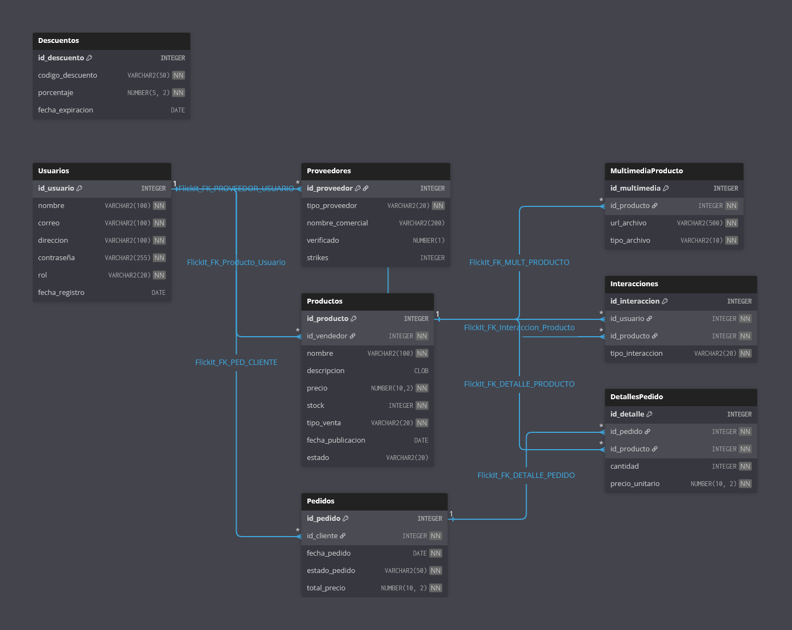

# **4\. Alcance de la Base de Datos**

Esta sección define el alcance del desarrollo de la Base de Datos (BBDD) de FlickIt, especificando las funcionalidades que serán soportadas, las restricciones operativas y los criterios que determinarán la finalización exitosa del proyecto.

## **4.1 Funcionalidades**

La base de datos de FlickIt soportará las siguientes capacidades funcionales:

* **Gestión de Usuarios y Roles:** Almacenará datos personales y métodos de autenticación (nombre, correo y contraseña). Gestionará roles (cliente | proveedor) de forma flexible, permitiendo a los clientes convertirse en proveedores al subir productos. Además, para los proveedores manejará información adicional (número de strikes, tipo de vendedor, etc), lo que permitirá un sistema de reputación en la app.  
    
* **Gestión del Catálogo de Productos:** Soportará el registro completo de productos (nombre, descripcion, precio, stock), registrando su condición (Primera mano | Segunda mano). Permitiendo además clasificarlos por diversas categorías y asociando archivos multimedia a cada producto (imágenes y videos).  
    
* **Ciclo de Vida del Producto (Moderación de la app):** La BBDD controlará el estado de cada producto: pendiente (recién subido), aprobado (visible), rechazado o bloqueado (violación de normas).  
    
* **Interacciones y Personalización:** Registrará las interacciones de los clientes (like/dislike) sobre los productos de forma coherente.  
    
* **Gestión de Transacciones:** Se mantendrá un registro completo de pedidos, detalles de los pedidos (productos y cantidades), estado del pedido (pendiente, enviado, entregado, cancelado) y aplicación de descuentos válidos.

## **4.2 Límites del sistema**

* **Gestión de Pagos Financieros:** La BBDD no almacena datos sensibles de pago (ej. números de tarjetas bancarias o códigos de paypal). La transacción financiera se gestionará fuera del alcance de la BBDD por una pasarela de pago externa.  
    
* **Comunicaciones directas:** No se desarrollará soporte para la gestión de chats o comunicación directa entre compradores y vendedores. Con el objetivo de evitar overlapping con apps como Wallapop o Milanuncios.  
    
* **Valoraciones numéricas (rating):** Aunque se permite la posibilidad de strikes para proveedores, la funcionalidad de valoración (puntuación o rating) no está directamente modelada en este esquema inicial. Aunque no se descarta el hecho de añadirlo a futuro implementando tablas extra como la de valoraciones en la base de datos.  
    
* **Asistencia:** No incluye asistente de IA ni motores de recomendación en la propia BBDD, pero pueden integrarse externamente. Los procesos automatizados lo estarán mediante uso de triggers, backend u otras herramientas clásicas de cualquier base de datos.

## **4.3 Entregables principales**

Scripts de sql adjuntos (Tablas, ejemplos de triggers).  
Casos de uso necesarios sobre la BBDD.  
Modelo R y de ser posible E/R.

## **4.4 Criterios de aceptación**

El proyecto será aceptado si la BBDD cumple los siguientes requisitos de diseño, que están respaldados por las restricciones SQL:

1. **Integridad Relacional (PK/FK/Restricciones):** Todas las tablas tienen clave primaria, todas las relaciones están definidas con claves foráneas coherentes y se cumplen las restricciones de unicidad (UNIQUE) y las reglas de negocio explícitas (CHECK), como el rol del usuario, el tipo de proveedor o el estado del producto.

2. **Funcionamiento básico:** la BBDD permite insertar y consultar usuarios, productos, multimedia, interacciones, pedidos y descuentos sin errores críticos y con integridad relacional.  
     
3. **Asociaciones obligatorias:** todo producto almacenado está asociado a una categoría válida y a un vendedor (FK no nula); los pedidos referencian clientes y productos existentes.

4. **Seguridad mínima:** La base de datos almacena contraseñas en formato hash y no se guarda ningún dato de pago sensible.  
     
5. **Auditoría mínima:** existen mecanismos documentados (tablas o triggers propuestos) para registrar cambios críticos (cambio de estado de producto, strikes, eliminación de entidades).

# **Resumen de funcionamiento general de la BBDD**

La base de datos de la aplicación FlickIt está diseñada para soportar un marketplace estilo Wallapop con formato swipe tipo Tinder, donde cualquier usuario puede comprar productos y, si lo desea, subir productos para vender. La base de datos mantiene la información de usuarios, productos, interacciones, pedidos y descuentos, asegurando consistencia, escalabilidad y seguridad.

En nuestro modelo de base de datos hemos decidido utilizar identificadores numéricos (ID) como claves primarias (PK) en todas las tablas. Esto permite mantener relaciones simples y eficientes entre tablas y facilita los JOINs para temas de mantenimiento de la base de datos al evitar problemas cuando cambian datos naturales (como correos o nombres). Todo esto asegura una estructura estable y escalable.

La funcionalidad es sencilla: simplemente todo usuario comienza siendo un cliente, pero en caso de subir un producto para vender se convierte en un proveedor. No obstante, aunque se convierta en proveedor mantendrá sus funcionalidades de usuario para comprar, lo que da flexibilidad e incita a subir productos sin mucha complicación.

Todo producto subido será revisado, o manual para ser marcado como:

* **Pendiente:** producto recién subido, no visible al público.  
* **Aprobado:** Visible al público y listo para ser comprado.  
* **Rechazado:** Violacion de normas, no aparece visible al público y será eliminado.  
* **Bloqueado:** No aparece visible al público, será borrado y el vendedor castigado debido a una violacion de normas grave. 

Como ya hemos visto, los proveedores pueden ser castigados en función de lo que suben, para evitar productos o imágenes inapropiadas o propensas a estafa y mantener al usuario seguro. El castigo se realiza mediante strikes y por cada strike extra irán apareciendo restricciones y suspensiones de cuenta ya sean temporales o permanentes.

Cabe recalcar que de todo producto se podrán almacenar detalles como una descripción del producto completa, imágenes, vídeos, stock y precio unitario. Además de que están unidos a una categoría para que se permita el filtrado correcto durante las búsquedas.

La idea es que todos los procesos estén automatizados mediante triggers o backend para que la base de datos pueda gestionarse sola y la aplicación sea lo más cómoda, confiable y segura para los usuarios.

Con este funcionamiento general, la base de datos garantiza que todos los procesos de compra, venta, moderación y seguimiento de interacciones se gestionen de manera consistente y segura. A continuación se describen los requerimientos funcionales, de usuario y no funcionales que permiten detallar cómo debe operar la base de datos y qué espera cada tipo de usuario de la aplicación.

# **5\. Requerimientos del Sistema**

Este apartado detalla las funciones, comportamientos, restricciones y expectativas que debe cumplir la Base de Datos de FlickIt para dar soporte al funcionamiento de la aplicación.

## **5.1 Requerimientos funcionales**

A continuación se establecen las funciones, servicios y comportamientos que debe ofrecer el sistema.

* Gestionar usuarios: registrar, iniciar sesión, actualizar perfil y contraseña.  
    
* Permitir que cualquier usuario pueda comprar productos y ver historial de pedidos.  
    
* Permitir que cualquier usuario pueda subir productos, convirtiéndose automáticamente en proveedor.  
    
* Gestionar la información de proveedores: tipo, nombre comercial, verificación y strikes.  
    
* Registrar productos: nombre, descripción, precio, stock, tipo de venta y estado de moderación.  
    
* Controlar la moderación de productos mediante estados: pendiente, aprobado, rechazado, bloqueado.  
    
* Gestionar multimedia de productos (imágenes y videos).  
    
* Registrar interacciones de usuarios sobre productos (like/dislike) para personalizar el feed.  
    
* Gestionar pedidos y detalles de pedidos, incluyendo cantidades, precios unitarios y total.  
    
* Aplicar descuentos mediante códigos válidos y vigentes.  
    
* Mantener historial de interacciones y transacciones para análisis y auditoría.  
    
* Automatizar procesos para mantener la base de datos actualizada al día mediante triggers o backend (ej. actualizar rol a proveedor al subir producto, incrementar strikes, cambiar estado de producto).

## **5.2 Requerimientos no funcionales**

A continuación se establecen las características de calidad, restricciones y atributos del sistema que determinan su rendimiento y cómo se ejecutan las funciones.

* **Rendimiento:** la base de datos debe asegurar tiempos de respuesta óptimos para consultas críticas, incluyendo la carga del feed tipo swipe y las búsquedas de productos (tanto búsquedas directas como por filtros).

* **Escalabilidad:** permitir crecimiento en número de usuarios, productos, pedidos y multimedia sin degradar la performance.

* **Integridad:** el diseño de la base de datos debe garantizar la consistencia mediante el uso de claves primarias, foráneas y restricciones de datos. Con el objetivo de evitar cualquier falla que colapse la aplicación.

* **Seguridad:** garantizar la protección mediante el cifrado de la información sensible como contraseñas, correos y datos de contacto de usuarios y proveedores, evitando todo acceso no autorizado a la base de datos.

* **Mantenibilidad:** La estructura debe ser clara, normalizada y fácil de ampliar y modificar (ej. añadir nuevas categorías, métodos de pago, etc).

* **Disponibilidad:** la base de datos debe estar disponible y operativa en tiempo real para la aplicación. Se deben minimizar las caídas, bloqueos o fallos de software, reservando el tiempo de inactividad solo para mantenimiento crítico (ej. fallos de hardware).

* **Auditoría y trazabilidad:** se deben poder registrar cambios importantes para permitir seguimiento de errores y control de fraude.  
    
* **Capacidad Mínima:** El sistema debe estar dimensionado para soportar al menos los siguientes volúmenes de datos en su etapa inicial: 1.000 usuarios, 500 productos publicados y la gestión de 10.000 interacciones iniciales.  
    
* **Almacenamiento:** La base de datos SQL requiere unos 15 GB de espacio para tener margen de maniobra, mientras que el almacenamiento para los archivos multimedia (imágenes y videos) necesita un mínimo de 100 GB de espacio dedicado.

## **5.3 Requerimientos de usuario**

A continuación se establecen las expectativas y necesidades que el usuario debe poder lograr mediante el uso del sistema en cuestión. Hemos decidido dividirlos en categorías.

**Para todos los usuarios**

* Poder registrarse, iniciar sesión y gestionar su perfil de forma sencilla y segura.  
* Usar la aplicación de manera fluida, confiable y segura.  
* No tener que crear cuentas adicionales para comprar/vender.

**Clientes**

* Poder buscar, filtrar y ordenar productos por precio, categoría, popularidad, estado, etc.  
*  Dar like/dislike a productos y realizar compras de forma ágil, utilizando la función de swipe característica de la aplicación.  
* Consultar strikes del proveedor de un producto.

**Proveedores**

* Los proveedores pueden subir productos  e imágenes/vídeos de forma sencilla.  
* Editar stock, precio o información del producto.  
* Ver estadísticas básicas de ventas.  
* Recibir notificaciones de productos rechazados/bloqueados.  
* Consultar sus strikes y restricciones asociadas.  
* Los proveedores pueden recibir alertas sobre productos rechazados o bloqueados y gestionar sus strike.
